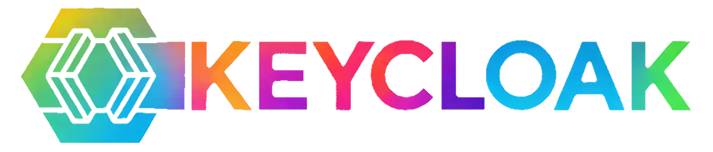

# Keycloak Adaptive Authentication Extension

## Getting started

### Container

You can use the container image by running:

    podman run -p 8080:8080 quay.io/mabartos/keycloak:adaptive start

This command starts Keycloak exposed on the local port 8080 (`localhost:8080`).

NOTE: If you have installed Docker, use `docker` instead of `podman`.

### Building from Source

To build from source, refer to the [building and working with the code base](docs/building-source.md) guide.

## Integration with OpenAI
In order to use the default OpenAI engine for risk scoring, create `.env` file in the working directory, or set following environment variables:

- `OPEN_AI_API_KEY` - OpenAI API key
- `OPEN_AI_API_ORGANIZATION` - OpenAI organization ID
- `OPEN_AI_API_PROJECT` - OpenAI project ID
- `OPEN_AI_API_URL`(optional) - OpenAI URL (default 'https://api.openai.com/v1/chat/completions')