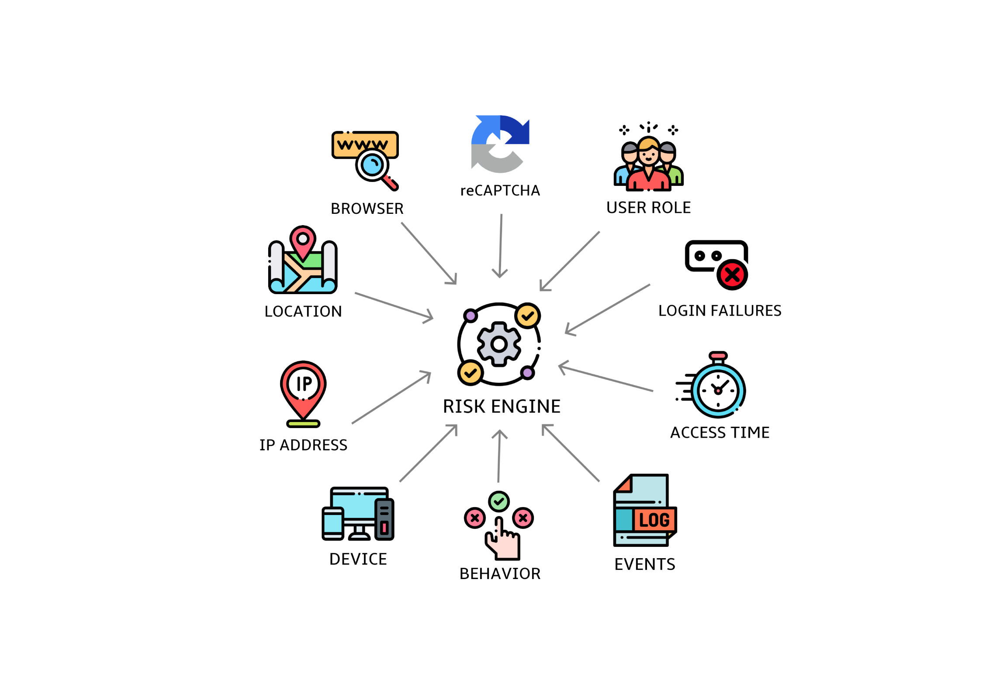

# Keycloak Adaptive Authentication

* Change **authentication requirements** in real-time based on wider context
* **Strengthen security** - Require **MORE** factors when user attempt is suspicious or accessing sensitive resources
* **Better User Experience** - Require **LESS** factors when risk of fraudulent user is low
* **Integration with remote services** - For more information about the user or helping evaluating data via remote
  services
* Gather **more information about user** in a secure way
* Uses **Risk-based** authentication
* Uses **AI services** for more complex risk evaluations

</img>

### Supported AI Engines

<table>
  <tr>
    <td align="center" width="200">
      <a href="https://chatgpt.com/">
        
      </a>
    </td>
    <td>
      <b><a href="https://chatgpt.com/">OpenAI ChatGPT</a></b><br/>
      Default model: <code>gpt-4o-mini</code><br/>
    </td>
  </tr>
  <tr>
    <td align="center">
      <a href="https://www.anthropic.com/claude">
        
      </a>
    </td>
    <td>
      <b><a href="https://www.anthropic.com/claude">Anthropic Claude</a></b><br/>
      Default model: <code>claude-haiku-4-5-20251001</code><br/>
    </td>
  </tr>
  <tr>
    <td align="center">
      <a href="https://ai.google.dev/">
        
      </a>
    </td>
    <td>
      <b><a href="https://ai.google.dev/">Google Gemini</a></b> (free tier available)<br/>
      Default model: <code>gemini-2.5-flash-lite</code><br/>
    </td>
  </tr>
  <tr>
    <td align="center">
      <a href="https://www.ibm.com/granite">
        
      </a>
    </td>
    <td>
      <b><a href="https://www.ibm.com/granite">IBM Granite</a></b> (deprecated)<br/>
      Default model: <code>granite-8b-code-instruct-128k</code><br/>
    </td>
  </tr>
</table>

Risk is evaluated **locally** as much as possible. AI engines are only used for complex evaluations that require deeper contextual analysis. Since AI services are **external dependencies**, all user data (IP addresses, device info) is **automatically anonymized** before being sent to prevent information leakage. See [Privacy and Anonymization Guide](docs/privacy-and-anonymization.md) for details.

For more information and setup, see the <a href="docs/ai-engine-integration.md">AI Integration Guide</a>.

## Supported Keycloak Versions

| Keycloak Version | Supported |
|------------------|-----------|
| 26.6.x           | Yes       |
| 26.5.x           | Testing ended June 2026 |
| main (nightly)   | Yes       |

## Getting Started

Build and try it out locally:

```shell
./mvnw clean install -DskipTests -Pbuild-distribution
./mvnw exec:exec@copy-extensions exec:exec@start-server
```

The generated JAR (`core/target/keycloak-adaptive-authn-*.jar`) can be added to the [`/providers`](https://www.keycloak.org/server/configuration-provider#_installing_and_uninstalling_a_provider) folder of your Keycloak distribution with additional JARs as extensions from the `/extensions` module. The core JAR is also available as a Maven package:

```xml
<dependency>
    <groupId>io.github.mabartos</groupId>
    <artifactId>keycloak-adaptive-authn</artifactId>
    <version>${version}</version>
    <type>jar</type>
</dependency>
```

For full build instructions, installation options, and configuration, see the [Start Guide](docs/start.md).

## Resources with more info

1. **Unlocking Adaptive Authentication (most recent)**
   - [Keycloak DevDay](https://www.keycloak-day.dev/) @ Darmstadt, Germany 2025
   - [Slides](https://drive.google.com/file/d/12-vAuVmWqUb3581D8WqWq0uutLbH7tsn/view?usp=sharing)
   - [Talk](https://www.youtube.com/watch?v=TjanummQn7U)
2. **Adaptive Authentication**
    - [KeyConf24](https://keyconf.dev/) @ Vienna, Austria 2024
    - [Slides](https://drive.google.com/file/d/1PESlDBR8P9nQJyPz_H45R3ZS4LjtSV_W/view?usp=sharing)
    - [Talk](https://www.youtube.com/watch?v=0zWlc08CPuo)
    - [Demo](https://drive.google.com/file/d/1dv5zWM69-KZyT3OUjLe-3b1GcI8ErDJ2/view?usp=sharing)
3. **AI-powered Keycloak**
    - OpenShiftAI Roadshow @ Bratislava, Slovakia 2024
    - [Slides](https://drive.google.com/file/d/1WscEQlWpjYdrOwGDMj9IDV6bARY-4Utn/view?usp=sharing)
4. **Adaptive Authentication**
    - Master's thesis completed 2024
    - (Information might differ)
    - [Document](https://github.com/mabartos/adaptive-authn-docs/blob/main/Adaptive_Authentication_Final.pdf)

## Connected Authentication Policies

**NOTE**: Authentication policies that were part of this Adaptive authentication initiative were moved to
repository [mabartos/keycloak-authn-policies](https://github.com/mabartos/keycloak-authn-policies).
