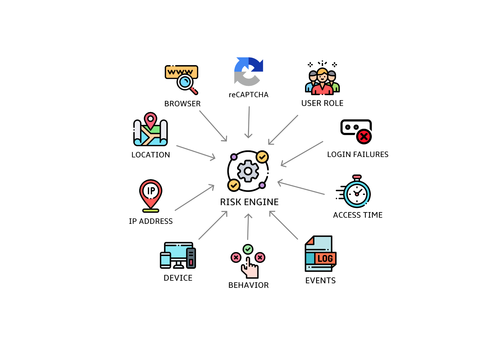

# Keycloak Adaptive Authentication

* Change **authentication requirements** in real-time based on wider context
* **Strengthen security** - Require **MORE** factors when user attempt is suspicious or accessing sensitive resources
* **Better User Experience** - Require **LESS** factors when risk of fraudulent user is low
* **Integration with remote services** - For more information about the user or helping evaluating data via remote
  services
* Gather **more information about user** in a secure way
* Uses **Risk-based** authentication
* Uses **AI services** for more complex risk evaluations

</img>

### Supported AI Engines

<table>
  <tr>
    <th align="center">
      
      <a href="https://chatgpt.com/">OpenAI ChatGPT</a><p></p>
    </th>
    <th align="center">
      
      <a href="https://www.ibm.com/granite">IBM Granite</a> (experimental)<p></p>
    </th>
  </tr>
  <tr>
    <td align="center">
      <a href="https://chatgpt.com/">
        
      </a>
    </td>
    <td align="center">
      <a href="https://www.ibm.com/granite">
        
      </a>
    </td>
  </tr>
</table>

It should work for all OpenAI ChatGPT compatible engines, but not verified.
For more information, refer to the [Start guide](docs/start.md).

## Connected Authentication Policies

**NOTE**: Authentication policies that were part of this Adaptive authentication initiative were moved to
repository [mabartos/keycloak-authn-policies](https://github.com/mabartos/keycloak-authn-policies).

## Getting started

### Building from Source

To build it from source, execute this command:

```shell
./mvnw clean install -DskipTests
```

If you want to try it out, follow this:

1. Build it with profile `-Pbuild-distribution` as:

```shell
./mvnw -f core clean install -DskipTests -Pbuild-distribution
```

2. Start the server with deployed extension

```shell
./mvnw exec:exec@start-server
```

3. Access `localhost:8080/realms/adaptive/account`.

### Container

**NOTE**: This is an old release with the authentication policies that are not part of this repository anymore.
Recommended way is to build it from source for now.

You can use the container image by running:

    podman run -p 8080:8080 quay.io/mabartos/keycloak-adaptive-all start

This command starts Keycloak exposed on the local port 8080 (`localhost:8080`).

In order to see the functionality in action, navigate to `localhost:8080/realms/authn-policy-adaptive/account`.

ℹ️ **INFO:** If you want to use the OpenAI capabilities, set the environment variables (by setting `-e OPEN_AI_API_*`)
for the image described in the [README](adaptive/README.md#integration-with-openai) of the `adaptive` module..

ℹ️ **INFO:** If you have installed Docker, use `docker` instead of `podman`.

## Resources with more info

1. **Adaptive Authentication (most recent)**
   - [Keycloak DevDay](https://www.keycloak-day.dev/) @ Darmstadt, Germany 2025
   - [Slides](https://drive.google.com/file/d/12-vAuVmWqUb3581D8WqWq0uutLbH7tsn/view?usp=sharing)
   - Talk - will be added once available
2. **Adaptive Authentication**
    - [KeyConf24](https://keyconf.dev/) @ Vienna, Austria 2024
    - [Slides](https://drive.google.com/file/d/1PESlDBR8P9nQJyPz_H45R3ZS4LjtSV_W/view?usp=sharing)
    - [Talk](https://www.youtube.com/watch?v=0zWlc08CPuo)
    - [Demo](https://drive.google.com/file/d/1dv5zWM69-KZyT3OUjLe-3b1GcI8ErDJ2/view?usp=sharing)
3. **AI-powered Keycloak**
    - OpenShiftAI Roadshow @ Bratislava, Slovakia 2024
    - [Slides](https://drive.google.com/file/d/1WscEQlWpjYdrOwGDMj9IDV6bARY-4Utn/view?usp=sharing)
4. **Adaptive Authentication**
    - Master's thesis completed 2024
    - (Information might differ)
    - [Document](https://github.com/mabartos/adaptive-authn-docs/blob/main/Adaptive_Authentication_Final.pdf)
